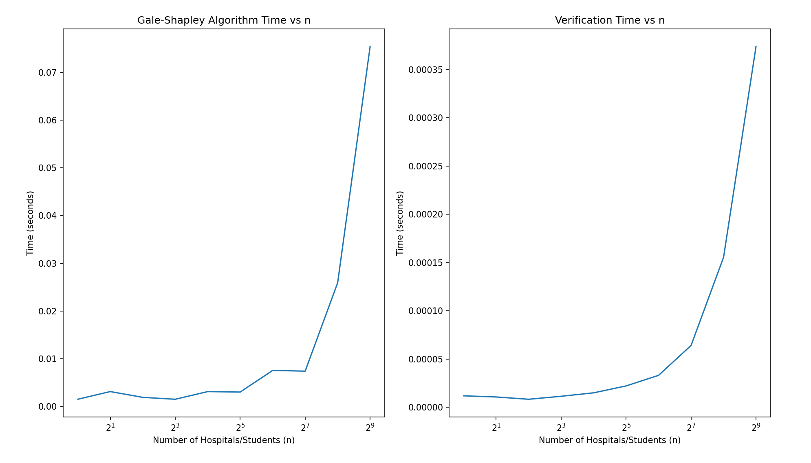

# COP4533-Matching-Verifying

Students: Maggie Yan (30309678), Kathryn Peters (59081734)

1. Instructions to run the matcher:
    - Located in "./src/matching_algo.py"
    - main() default takes in "./data/example.in" file
    - To test different inputs, edit the "./data/example.in" file with the input style specified in the assignment
    - We are assuming that the "./data/example.in" file must only contain integers and spaces
    - The output will be written to "./data/example.out" with the output style specified in the assignment
    - To run via the command line, ensure current directory is "COP4533-Matching-Verifying" and run this command: 

        `python src/matching_algo.py`

2. Instructions to run the verifier:
    - Located in "./src/verifier.py"
    - The verifier runs the algorithm once, before verifying the output
    - To match and verify the outputs of different inputs, edit the "./data/example.in" file with the input style specified in the assignment
    - To run the verifier, use the default play button located in the upper right hand corner in VSCode
    - To run via the command line, ensure current directory is "COP4533-Matching-Verifying" and run this command:
    
        `python src/verifier.py`

3. Graph and solution to Task C:
    - The general trend we noticed when testing the run time of increasingly large inputs is that it takes an increasingly longer time, for both the matcher and the verifier. There is a little oscillation at the beginning of the matcher time complexity (e.g. 8 inputs takes slightly less time than 2 inputs; and 2^7 inputs takes slightly less time than 2^6 inputs), but as n approaches larger and larger values (such as 2^9), the graph becomes exponential.

4. Extra notes:
    - if you want to run the time complexity file located in "./src/scalability.py," you must install matplotlib library to view the graphs
    - the folder "./testdata" contains example inputs for testing the time complexity of the matcher and the verifier
